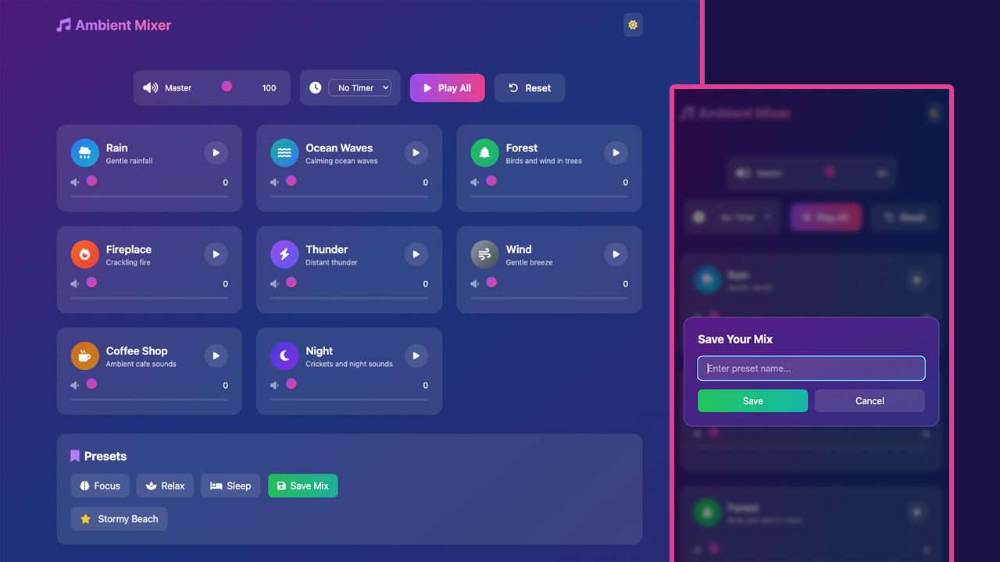

# Ambient Sound Mixer 🎵

Create your perfect atmosphere with this beautiful and intuitive ambient sound mixer. Mix and match various nature sounds, white noise, and ambient audio to enhance focus, relaxation, or sleep.

This is part of my [Modern JS From The Beginning 2.0 course(https://www.traversymedia.com/modern-javascript-2-0). So no pull requests will be accepted. The code has to match the course.

The theme (HTML/CSS/Audio Only) is in <a href="https://github.com/bradtraversy/ambient-sound-mixer/tree/main/ambient-sound-mixer-template">/ambient-sound-mixer-template</a>



## ✨ Features

### 🎛️ Sound Mixing
- **12+ High-Quality Ambient Sounds** - Rain, thunderstorm, ocean waves, forest, fireplace, wind, white noise, coffee shop ambience, and more
- **Individual Volume Controls** - Fine-tune each sound independently with smooth volume sliders
- **Master Volume Control** - Adjust overall mix volume instantly
- **Play/Pause Individual Sounds** - Toggle sounds on/off while maintaining volume settings
- **Visual Feedback** - Animated sound cards with hover effects and play state indicators

### 🎨 Presets & Customization
- **Built-in Presets** - Quick access to pre-made mixes:
  - 🧠 **Focus** - Optimized for concentration and productivity
  - 🧘 **Relax** - Perfect for meditation and unwinding
  - 😴 **Sleep** - Gentle sounds to help you fall asleep
- **Save Custom Presets** - Create and save your own perfect sound combinations
- **Persistent Storage** - Your custom presets are saved locally and available on return visits
- **Delete Custom Presets** - Remove unwanted saved presets with a simple click

### ⏱️ Timer Features
- **Sleep Timer** - Set automatic stop timers (5, 15, 30, or 60 minutes)
- **Visual Countdown** - See remaining time at a glance
- **Auto-Stop** - All sounds fade out smoothly when timer expires

### 🎨 User Interface
- **Dark/Light Theme Toggle** - Switch between beautiful dark and light color schemes
- **Responsive Design** - Works perfectly on desktop, tablet, and mobile devices
- **Smooth Animations** - Polished transitions and hover effects
- **Gradient Backgrounds** - Dynamic color gradients that adapt to theme
- **Backdrop Blur Effects** - Modern glassmorphism design elements

### 🔧 Technical Features
- **No Installation Required** - Runs directly in your browser
- **Offline Support** - Once loaded, works without internet connection
- **LocalStorage Integration** - Saves your preferences and custom presets
- **Modular Architecture** - Clean, maintainable code structure
- **ES6 Modules** - Modern JavaScript with proper separation of concerns

## 📁 Project Structure

```
ambient-sound-mixer/
├── index.html              # Main HTML file
├── css/
│   └── styles.css         # Custom styles and animations
├── js/
│   ├── app.js            # Main application logic
│   ├── soundData.js     # Sound definitions and presets
│   ├── soundManager.js  # Audio handling and playback
│   ├── presetManager.js # Preset save/load functionality
│   ├── timer.js         # Timer implementation
│   └── ui.js            # UI components and interactions
├── sounds/              # Audio files directory
│   ├── rain.mp3
│   ├── ocean.mp3
│   ├── forest.mp3
│   └── ...              # Additional sound files
└── screen.png           # Application screenshot

```

